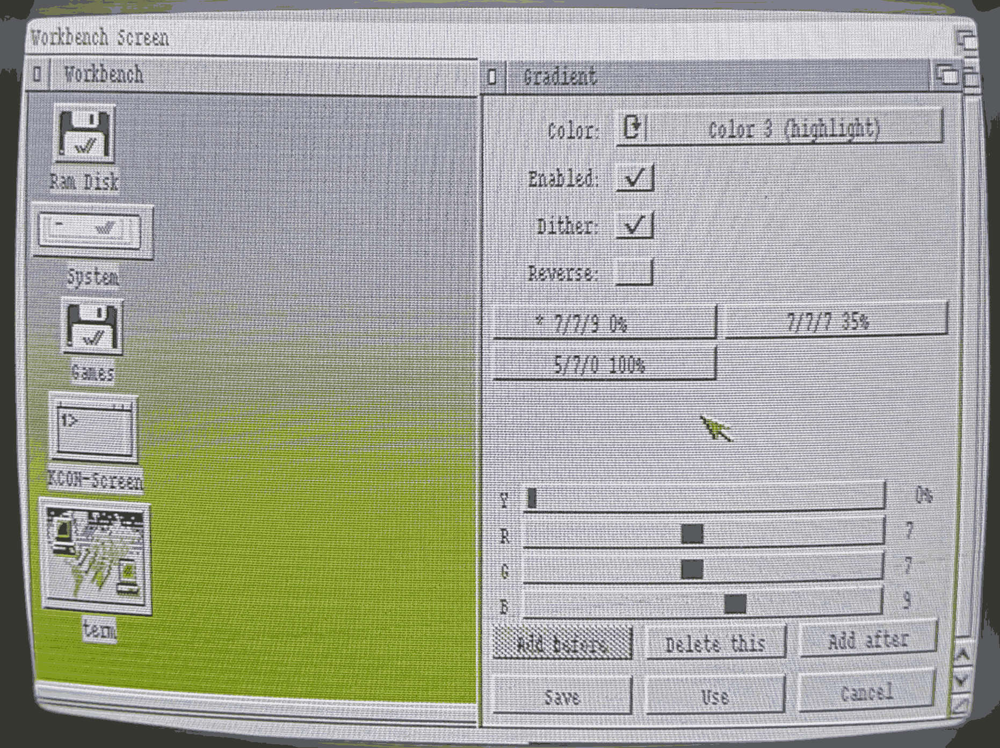

# Copper Gradient utility — Amiga side



A Workbench-friendly utility that drives one or more WB color registers from
a copperlist, painting smooth vertical gradients across the desktop. Built
for Kickstart/Workbench 3.x on Amiga 600 (ECS, 68000); should work on any
3.x Amiga.

The program registers itself with **Commodities Exchange** as the standard
Amiga way to live as a background utility, so you can show/hide its window,
disable/enable its effect, or remove it cleanly through the Exchange app.

---

## 1. Files

| File                              | What it is                              |
| --------------------------------- | --------------------------------------- |
| `Gradient`                        | The executable. Hunk format.            |
| `ENV:Gradient.prefs`              | Live settings (read at every launch). ~290 bytes binary. |
| `ENVARC:Gradient.prefs`           | Persistent copy. The system copies `ENVARC:` → `ENV:` early in boot, before `User-Startup` runs. |
| Public broker `"Gradient"`        | Created at runtime, listed in Exchange. |

You don't have to create the prefs files; they're written automatically
when you click **Save** in the editor.

---

## 2. Install

From a Shell:

```
copy Gradient SYS:Tools/Commodities/
copy SYS:Tools/Commodities/Blanker.info SYS:Tools/Commodities/Gradient.info
```

That's it for the install.

The first line copies the executable into the Commodities drawer.

The second line gives `Gradient` an icon by reusing `Blanker.info`.
Workbench needs an `.info` file next to an executable to display it on
the desktop, and rather than ship a custom one, `Gradient` borrows the
icon already used by `Blanker` — another commodity that ships with
every standard Workbench 3.x install (the screen-blanker found in
`SYS:Tools/Commodities/`). Reusing it has two upsides: no extra file to
ship, and the icon already carries `WBStartup`-friendly tooltypes that
`Gradient` understands (`DONOTWAIT`, etc.). The visual is just
`Blanker`'s icon; the program behind it is `Gradient`. If `Blanker.info`
is missing on your install, copy any other `.info` from
`SYS:Tools/Commodities/` (e.g. `AutoPoint.info`, `ClickToFront.info`)
the same way.

Now from Workbench:

1. Open `SYS:Tools/Commodities/`. If the window was already open before
   the `copy`, pick **Window → Update** so it re-reads the drawer.
2. **Double-click `Gradient`**. The editor window opens.
3. Configure your gradient (pick a color register, edit stops, etc.).
4. Click **Save**. Settings are written to `ENVARC:Gradient.prefs` and
   survive reboot.

You can launch `Gradient` again from Commodities any time — Save is the
only persistence step.

### 2.1 Make it start at every boot

Settings persist via Save, but Exchange itself doesn't remember which
commodities should be running — only `SYS:WBStartup/` does that.
After the basic install, do this once:

1. From a Shell, copy both the executable and the icon into the
   WBStartup drawer:
   ```
   copy SYS:Tools/Commodities/Gradient SYS:WBStartup/
   copy SYS:Tools/Commodities/Gradient.info SYS:WBStartup/
   ```
   (Workbench equivalent: hold Shift and drag the `Gradient` icon
   from `Tools/Commodities/` to `WBStartup/`. Shift = copy.)
2. Open `SYS:WBStartup/` on Workbench (or pick **Window → Update**
   if it was already open).
3. Single-click the new `Gradient` icon, then **Icons → Information…**.
4. In the **Tool Types** list, add these two lines:
   ```
   DONOTWAIT
   BACKGROUND
   ```
   - `DONOTWAIT` is mandatory for anything in `WBStartup/` — it tells
     Workbench not to wait for the program to exit before continuing
     boot.
   - `BACKGROUND` tells Gradient to skip the editor window at boot
     and just install the gradient quietly. Without it, the editor
     would pop up every time you log in.
   - Optional: `LOAD=path/to/file.prefs` to start with a non-default
     preset.
5. **Save** the Information requester. Reboot.

To verify, open `SYS:Tools/Commodities/Exchange` after the reboot —
`Gradient` should appear with `Active = yes`. To later disable
autostart, just drag the icon out of `SYS:WBStartup/`.

The same recipe (Shift-drag plus `DONOTWAIT`) works for any other
commodity (Blanker, ClickToFront, AutoPoint, …) you want auto-started
at boot.

---

## 3. Run the editor (interactive)

From CLI / Shell:

```
Gradient
```

(or double-click an icon if you've made one). The window opens with the
current saved settings — or a default 3-stop Gradient on Color 3 if none
exist yet.

If Gradient is already running in the background and you launch it again,
the *running* instance simply pops its window to the front (Commodities
`UNIQUE` semantics) — you never get two instances fighting over the
copperlist.

### Controls

- **Color**: which Workbench color register (0..3) you're editing.
- **Enabled**: turn the copper override on/off for this register.
- **Dither**: ordered vertical dithering; hides 4-bit-per-channel
  step boundaries. On by default.
- **Reverse**: flip the Gradient (Y=100% paints at the top).
- **Stop buttons** (`R/G/B Y%`): one per Gradient stop. The currently
  selected one is prefixed `*`. Up to 8 stops.
- **Y / R / G / B sliders**: edit the selected stop's position and color.
  Updates the copperlist live as you drag.
- **Add before / Add after / Delete this**: stop-list management. Disabled
  when not applicable.
- **Save / Use / Cancel** (the standard Amiga prefs trio):
  - **Save** — write `ENV:Gradient.prefs` *and* `ENVARC:Gradient.prefs`,
    close the editor window. The daemon keeps running with the new
    settings.
  - **Use** — write `ENV:` only (live, lost on reboot), close the editor.
  - **Cancel** — discard your edits, revert the copperlist to what it
    was when the editor opened, close the editor. Window close gadget
    is equivalent to Cancel.

In all three cases the *background broker* keeps running. Closing the
editor doesn't quit the program — see the next section for that.

---

## 4. Control via Commodities Exchange

Run `Tools/Commodities/Exchange` (or wherever your WB has the Exchange
program). You'll see `Gradient` listed alongside any other commodities
you have running (Blanker, AutoPoint, etc.). The standard buttons:

| Button   | What it does                                                |
| -------- | ----------------------------------------------------------- |
| **Show** | Pop the editor window so you can change the Gradient.       |
| **Hide** | Close the editor window (without saving — like Cancel).     |
| **Enable** | Re-attach the copperlist; Gradient appears on Workbench.  |
| **Disable** | Detach the copperlist; Workbench's normal palette returns (broker stays). |
| **Remove** | Quit Gradient entirely. The broker is removed from Exchange. |

### 4.1 Custom prefs file

```
Gradient LOAD=DH0:my-presets/blue-Gradient.prefs
Gradient BACKGROUND LOAD=DH0:my-presets/blue-Gradient.prefs
```

Useful for keeping multiple presets and switching by command line. As a
Tool Type on a `WBStartup/Gradient` icon, the same `LOAD=…` line picks
the preset at boot.

### 4.2 CLI alternative to WBStartup

If you'd rather start it from `S:User-Startup` than `WBStartup/`, add:

```
Run >NIL: C:Gradient BACKGROUND
```

`Run >NIL:` detaches it from the Shell; `BACKGROUND` skips opening the
editor window. Adjust the path if `Gradient` lives somewhere other than
`C:`.

---

## 5. Coexistence with games and demos (WHDLoad etc.)

Short answer: **fine — the broker is fully passive while a game runs and
your Gradient resumes automatically when the game exits.**

Long answer:
- WHDLoad slaves and most demos take over the chipset directly
  (`LoadView(NULL)`, write COP1LC, etc.). While they run, AmigaOS
  graphics is dormant — it isn't running our copperlist; the game's
  copper drives the display. Nothing to conflict with.
- When the game exits cleanly it restores the OS view via
  `LoadView(GfxBase->ActiView)` + `RethinkDisplay()`; graphics.library
  re-merges its copperlists, sees our `UCopList` still attached, and
  the Gradient is back. We do nothing.
- If the game does a hard reboot (some old slaves do), the daemon dies
  with everything else — `WBStartup/` re-launches it on the next boot.
- Our task runs at priority **−1**, so even when the broker is awake it
  never competes with foreground apps for CPU.

---

## 6. Build (host side, Linux + vbcc)

If the cross-toolchain is already installed under `./toolchain/`:

```
. ./env.sh
make Gradient
```

Produces `Gradient` (Hunk executable). `file Gradient` should report
`AmigaOS loadseg()ble executable/binary`. Copy it to the Amiga.

If you're starting from a fresh clone (`toolchain/` is gitignored), see
[BUILDING.md](BUILDING.md) for the one-time toolchain install
(vbcc + vasm + vlink + NDK 3.2 — about 5 minutes, ~250 MB on disk).

---

## 7. Troubleshooting

- **The editor window doesn't appear when I run `Gradient` from Shell.** —
  Look at Workbench. The Gradient should be visible. The window may have
  opened behind your Shell window — drag the Shell aside, or use
  `LeftAmiga + M` to bring Workbench to front.
- **Exchange shows Gradient but Show does nothing.** — On some 3.x
  systems Exchange sends `APPEAR` only when the broker has `COF_SHOW_HIDE`
  set; we set it. If the window still doesn't appear, check that the
  Workbench public screen is unlocked (no full-screen app holding it).
- **`Version Gradient` says "no version info available".** — Try
  `Version FULL Gradient` — some Versions are picky about the path.
- **The window doesn't fit on screen.** — The editor needs roughly 250
  lines of Workbench height. If you're in NTSC (200 lines) the bottom
  may be clipped. Try Prefs → ScreenMode → PAL or enable overscan.
